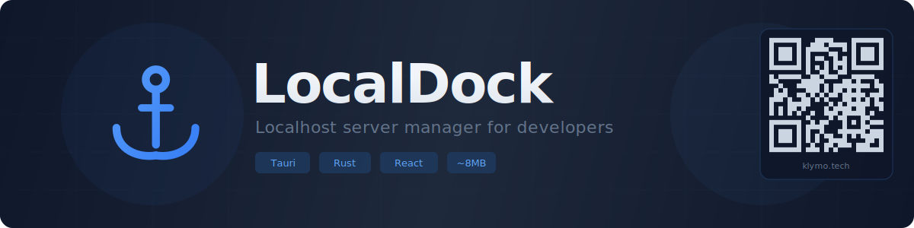

<div align="center">



<br/>

[](https://github.com/andrey-dev-ai/localdock)
[](https://v2.tauri.app)
[](https://www.rust-lang.org)
[](https://react.dev)
[](https://www.typescriptlang.org)
[]()
[]()
[](LICENSE)

**See every dev server running on your machine. Stop any of them with one click.**

[Download](#-quick-start) · [Features](#-features) · [How It Works](#-how-it-works) · [Architecture](#-architecture)

</div>

---

## The Problem

You're running Next.js on `:3000`, Vite on `:5173`, an API on `:8080`, maybe a database on `:5432` — and you have no idea which one is which until you open each port in your browser.

**LocalDock** is a tiny (~8MB) tray app that watches `localhost` and shows you everything that's listening — with process names, frameworks, uptimes, and one-click controls.

<div align="center">

> 🚧 **Screenshot coming soon** — the app is in active development

</div>

## ✦ Features

| | Feature | Details |
|---|---|---|
| 🔍 | **Auto-Discovery** | Scans all listening ports every 3 seconds |
| 🏷️ | **Process Recognition** | 50+ known processes with descriptions (VS Code, Node.js, PostgreSQL...) |
| 🧩 | **Framework Detection** | Reads `package.json` → identifies Next.js, Vite, Express, Python, and more |
| 📂 | **Project Names** | Shows project directory name for dev servers |
| ⏱️ | **Live Uptime** | Real-time uptime counter, ticking every second |
| 🗂️ | **Smart Grouping** | Categories: **Dev** / **Applications** / **System** with color-coded headers |
| 🌐 | **Open in Browser** | One click → `http://localhost:{port}` |
| 🛑 | **Stop Server** | Kill any process. System processes require confirmation |
| 📌 | **System Tray** | Minimize to tray, keeps running in background |
| 🚀 | **Auto-Start** | Toggle launch-on-boot from the status bar |
| 🔒 | **Safe by Design** | CSP enabled, port validation, no child-process killing |

## ⚡ Quick Start

**Prerequisites:** [Rust](https://rustup.rs/) + [Node.js 18+](https://nodejs.org/)

```bash
git clone https://github.com/andrey-dev-ai/localdock.git
cd localdock
npm install
npx tauri dev
```

**Build portable exe:**

```bash
npx tauri build
# → src-tauri/target/release/localdock.exe (~8MB)
```

## ⚙ How It Works

```
 ① netstat -ano         → all listening ports + PIDs
 ② tasklist /FO CSV     → PID → process name mapping
 ③ KNOWN_PROCESSES[50]  → category + human-readable description
 ④ PowerShell → CWD     → package.json → framework detection
 ⑤ React UI             → grouped cards with live controls
```

**Polling cycle:** every **3 seconds** the Rust backend runs steps ①–④ and returns a `Vec<Server>` to React via Tauri IPC. The UI re-renders only on state changes. Status bar timer ticks independently every second.

## 🏗 Architecture

```
┌──────────────────────────────────────┐
│           React + Tailwind           │
│                                      │
│  Header ─ ServerList ─ ServerCard    │
│  StatusBar ─ useServers (3s poll)    │
│               │ invoke()             │
└───────────────┼──────────────────────┘
                ▼
┌──────────────────────────────────────┐
│          Tauri v2 · Rust             │
│                                      │
│  lib.rs ─────── commands + tray      │
│  scanner.rs ─── netstat + tasklist   │
│  detector.rs ── framework ID         │
│  process.rs ─── taskkill /PID /F     │
└──────────────────────────────────────┘
```

<details>
<summary><b>Rust modules breakdown</b></summary>

| Module | Responsibility |
|--------|---------------|
| `lib.rs` | Tauri commands (`get_servers`, `kill_server`, `open_in_browser`), `KNOWN_PROCESSES` table (50 entries), system tray with context menu, autostart plugin |
| `scanner.rs` | Parses `netstat -ano` → `HashMap<PID, HashSet<Port>>` (IPv4/IPv6 dedup), resolves process names via `tasklist`, gets uptime via PowerShell |
| `detector.rs` | Reads `package.json` from process CWD → identifies framework and project name |
| `process.rs` | Terminates processes via `taskkill /PID /F` (no `/T` — doesn't kill child tree) |

</details>

<details>
<summary><b>React components breakdown</b></summary>

| Component | Responsibility |
|-----------|---------------|
| `useServers.ts` | Polls backend every 3s, retry with backoff (3 attempts), timer cleanup |
| `Header.tsx` | SVG anchor logo + server count with proper pluralization |
| `ServerCard.tsx` | Card: name, description/badge, port, framework, uptime, "Open"/"Stop" buttons |
| `ServerList.tsx` | Groups by category (dev/app/system), color-coded section headers |
| `StatusBar.tsx` | Ticking timer + manual refresh + autostart toggle |

</details>

## 🛡 Security

- **CSP** — `default-src 'self'; style-src 'self' 'unsafe-inline'; script-src 'self'`
- **Port guard** — `open_in_browser` blocks system ports (< 1024)
- **Safe kill** — no `/T` flag = only target PID, never the process tree
- **Confirmation** — system processes (svchost, lsass) require explicit user approval
- **No admin** — runs with standard user privileges

## 🗺 Roadmap

- [x] Auto-discovery with framework detection
- [x] System tray with background mode
- [x] Auto-start on Windows boot
- [x] Kill confirmation for system processes
- [ ] Search and filter servers
- [ ] Favorites / pinned servers
- [ ] Port conflict warnings
- [ ] macOS & Linux support
- [ ] Notification on new server detected

## 🛠 Tech Stack

| Layer | Technology |
|-------|-----------|
| Runtime | [Tauri v2](https://v2.tauri.app) — Rust-powered, webview-based |
| Backend | Rust (netstat, tasklist, PowerShell) |
| Frontend | React 19 + TypeScript 5 |
| Styling | Tailwind CSS 3 |
| Bundler | Vite 6 |
| Plugins | `tauri-plugin-autostart` |

## 📄 License

MIT — do whatever you want.

---

<div align="center">

Built with [Claude Code](https://claude.ai/claude-code) by [@andrey-dev-ai](https://github.com/andrey-dev-ai)

</div>
